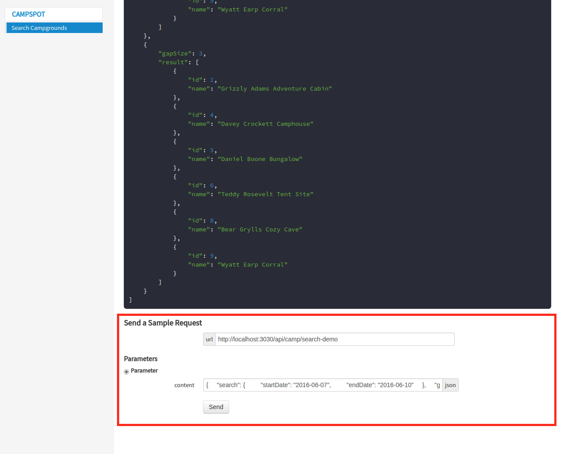

# campspot-node

#### Approach Document and How To 

The approach in the following PDF will explain the challenge and the 
decisions made. The rest of this readme will be a better source for the project
layout and tech side. You can find the approach document here:

[Approach Document and Explanation](documentation/CampspotAPIHowTo.pdf)


#### Instructions to run the app:

**First, clone this git repository**
```sh
git clone --depth=1 https://github.com/virtualadrian/campspot-node campspot-node
cd campspot-node
```


**Restore packages and dependencies**
```sh
npm install
```


**How To Start The Application:**
```sh
# requires gulp to be installed globally
npm i -g gulp

# run the api - this should open a browser with an API runner
gulp serve
```

Running 'gulp serve' will also open the API runner, and extra docs:

- - -


- - -

The API Runner provides sample payloads, a 'How-To' on getting started, and how to easily test the API. The easiest 
way is to use the form at the bottom of the page, while 'gulp serve' is running and subit a few payloads
with the provided form. 

- - -



- - -

An additional choice and a personal favorite is 
[Postman, a Google Chrome Application](https://chrome.google.com/webstore/detail/postman/fhbjgbiflinjbdggehcddcbncdddomop)
 this will provide the most versatility when running this API and others in the future.


**How To Execute Unit Tests**
```sh
# run tests
gulp mocha

# run tests without linting
gulp mocha --nolint
```

Running the tests will also lint the code, if you make a change and just want to run the unit test
without worrying about lint, then the second command I provided is there. However, keep in mind
that this should not be the rule but the exception. As Uncle Ben said: "With great power comes great responsibility." :)

Once the tests run the console will display the results of the task:

- - -


- - -

The mocha task will also launch the coverage report in your default browser. Here you can inspect the detail
of the istanbul coverage reporter. The first screen offers a summary:
 
- - -


- - -

You can also drill into specific files to see why your code coverage is DEVASTATINGLY AWESOME!!!  or sad and bleak. 
Just click the file you want to inspect.

- - -


- - -


**Other gulp tasks:**
```sh
# Default task: Wipes out dist and coverage directory. Compiles using babel.
gulp

# Lint code with ESLint
gulp lint
```

